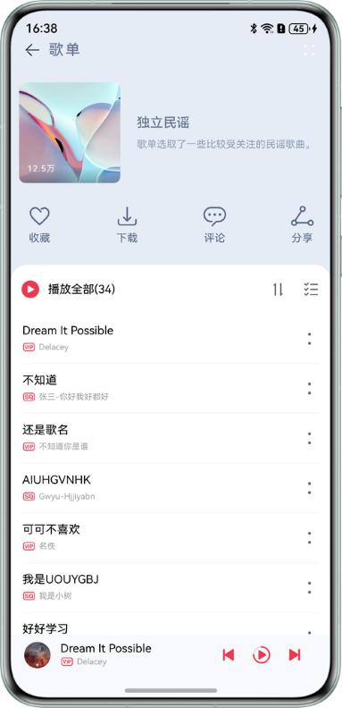
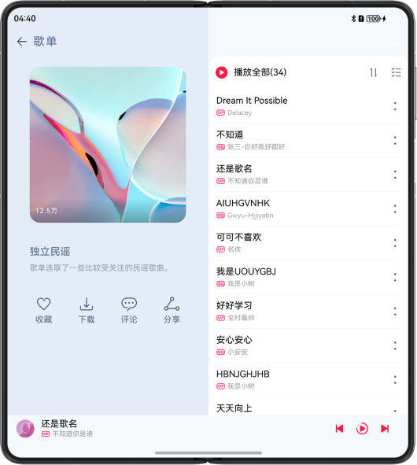
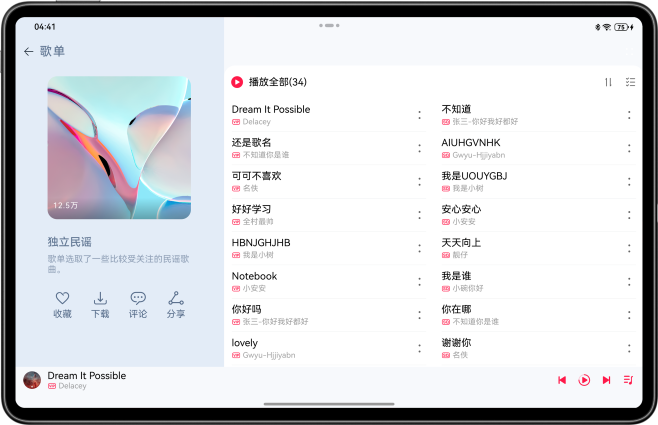
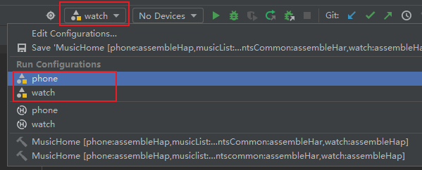

MusicHome-master/
├── .hvigor/ # Hvigor构建缓存目录
│ ├── cache/ # 构建缓存
│ │ ├── file-cache.json
│ │ ├── meta.json
│ │ └── task-cache.json
│ ├── dependencyMap/ # 依赖映射
│ │ ├── constantscommon/
│ │ ├── live/
│ │ ├── mediacommon/
│ │ ├── musiccomment/
│ │ ├── musiclist/
│ │ ├── phone/
│ │ ├── watch/
│ │ └── dependencyMap.json5
│ ├── outputs/ # 构建输出
│ │ ├── build-logs/
│ │ │ └── build.log
│ │ ├── logs/
│ │ │ └── details/
│ │ │ └── details.json
│ │ └── sync/
│ │ ├── fileCache.json
│ │ └── output.json
│ └── report/ # 构建报告
│ ├── report-202604211708196450.json
│ └── report-202604211709415430.json
├── .idea/ # IDE配置文件
│ ├── .deveco/
│ │ ├── cxx/
│ │ └── module/
│ └── modules/
├── AppScope/ # 应用全局配置
│ ├── resources/ # 全局资源文件
│ │ ├── base/
│ │ │ ├── element/ # 全局元素定义
│ │ │ │ └── string.json
│ │ │ └── media/ # 全局媒体资源
│ │ │ ├── background.png
│ │ │ ├── foreground.png
│ │ │ └── layered_image.json
│ │ └── (其他语言目录)
│ └── app.json5 # 应用配置
├── common/ # 公共能力层
│ ├── constantscommon/ # 公共常量模块
│ │ ├── build/ # 构建目录
│ │ │ └── default/
│ │ │ └── intermediates/
│ │ ├── src/
│ │ │ └── main/
│ │ │ ├── ets/ # ArkTS源代码
│ │ │ │ └── constants/ # 常量定义
│ │ │ ├── resources/ # 资源文件
│ │ │ └── module.json5 # 模块配置
│ │ ├── build-profile.json5 # 构建配置
│ │ ├── BuildProfile.ets # 构建配置文件
│ │ ├── hvigorfile.ts # Hvigor构建脚本
│ │ ├── index.ets # 模块入口
│ │ └── oh-package.json5 # 模块包配置
│ └── mediacommon/ # 公共媒体方法模块
│ ├── build/
│ │ └── default/
│ │ └── intermediates/
│ ├── oh_modules/ # 模块依赖
│ │ └── constantscommon/
│ ├── src/
│ │ └── main/
│ │ ├── ets/
│ │ │ ├── utils/ # 工具类
│ │ │ └── viewmodel/ # 视图模型
│ │ ├── resources/
│ │ └── module.json5
│ ├── build-profile.json5
│ ├── BuildProfile.ets
│ ├── hvigorfile.ts
│ ├── index.ets
│ ├── oh-package-lock.json5
│ └── oh-package.json5
├── docs/ # 项目文档
│ ├── API_REFERENCE.md # API参考文档
│ ├── ARCHITECTURE.md # 架构设计文档
│ ├── DEVELOPMENT_GUIDE.md # 开发指南
│ └── README.md # 文档说明
├── features/ # 基础特性层
│ ├── live/ # 直播页模块
│ │ ├── build/
│ │ │ └── default/
│ │ │ └── intermediates/
│ │ ├── src/
│ │ │ └── main/
│ │ │ ├── ets/
│ │ │ │ ├── constants/ # 直播相关常量
│ │ │ │ ├── view/ # 直播视图组件
│ │ │ │ └── viewmodel/ # 直播视图模型
│ │ │ ├── resources/ # 直播资源文件
│ │ │ └── module.json5 # 直播模块配置
│ │ ├── build-profile.json5
│ │ ├── BuildProfile.ets
│ │ ├── hvigorfile.ts
│ │ ├── Index.ets # 直播模块入口
│ │ └── oh-package.json5
│ ├── musiccomment/ # 音乐评论模块
│ │ ├── build/
│ │ │ └── default/
│ │ │ └── intermediates/
│ │ ├── oh_modules/ # 模块依赖
│ │ │ ├── constantscommon/
│ │ │ └── mediacommon/
│ │ ├── src/
│ │ │ └── main/
│ │ │ ├── ets/
│ │ │ │ ├── constants/ # 评论相关常量
│ │ │ │ ├── view/ # 评论视图组件
│ │ │ │ └── viewmodel/ # 评论视图模型
│ │ │ ├── resources/ # 评论资源文件
│ │ │ └── module.json5
│ │ ├── build-profile.json5
│ │ ├── BuildProfile.ets
│ │ ├── hvigorfile.ts
│ │ ├── Index.ets # 评论模块入口
│ │ ├── oh-package-lock.json5
│ │ └── oh-package.json5
│ ├── musiclist/ # 歌曲列表模块
│ │ ├── build/
│ │ │ └── default/
│ │ │ └── intermediates/
│ │ ├── oh_modules/ # 模块依赖
│ │ │ ├── constantscommon/
│ │ │ └── mediacommon/
│ │ ├── src/
│ │ │ └── main/
│ │ │ ├── ets/
│ │ │ │ ├── components/ # 音乐列表组件
│ │ │ │ │ ├── AlbumComponent.ets
│ │ │ │ │ ├── AlbumCover.ets
│ │ │ │ │ ├── ControlAreaComponent.ets
│ │ │ │ │ ├── Header.ets
│ │ │ │ │ ├── ListContent.ets
│ │ │ │ │ ├── LyricsComponent.ets
│ │ │ │ │ ├── MusicControlComponent.ets
│ │ │ │ │ ├── MusicInfoComponent.ets
│ │ │ │ │ ├── Player.ets
│ │ │ │ │ ├── PlayList.ets
│ │ │ │ │ └── TopAreaComponent.ets
│ │ │ │ ├── constants/ # 音乐列表常量
│ │ │ │ │ ├── ContentConstants.ets
│ │ │ │ │ ├── HeaderConstants.ets
│ │ │ │ │ └── PlayerConstants.ets
│ │ │ │ ├── lyric/ # 歌词相关
│ │ │ │ │ ├── LrcEntry.ets
│ │ │ │ │ ├── LrcUtils.ets
│ │ │ │ │ ├── LrcView.ets
│ │ │ │ │ └── LyricConst.ets
│ │ │ │ ├── view/ # 音乐列表视图
│ │ │ │ │ └── MusicListPage.ets
│ │ │ │ └── viewmodel/ # 音乐列表视图模型
│ │ │ │ ├── SongDataSource.ets
│ │ │ │ └── SongListData.ets
│ │ │ ├── resources/ # 音乐列表资源文件
│ │ │ └── module.json5
│ │ ├── build-profile.json5
│ │ ├── BuildProfile.ets
│ │ ├── hvigorfile.ts
│ │ ├── Index.ets # 音乐列表模块入口
│ │ ├── oh-package-lock.json5
│ │ └── oh-package.json5
│ └── README.md # 特性层说明文档
├── hvigor/ # Hvigor构建配置
│ └── hvigor-config.json5 # Hvigor配置文件
├── oh_modules/ # 项目依赖模块
├── products/ # 产品定制层
│ ├── phone/ # 手机/折叠/平板入口模块
│ │ ├── build/
│ │ │ ├── config/
│ │ │ │ └── buildConfig.json # 构建配置
│ │ │ └── default/
│ │ │ ├── cache/
│ │ │ ├── generated/
│ │ │ ├── intermediates/
│ │ │ └── outputs/
│ │ ├── oh_modules/ # 模块依赖
│ │ │ ├── constantscommon/
│ │ │ ├── live/
│ │ │ ├── musiccomment/
│ │ │ └── musiclist/
│ │ ├── src/
│ │ │ └── main/
│ │ │ ├── ets/
│ │ │ │ ├── common/ # 公共组件
│ │ │ │ │ └── constants/
│ │ │ │ │ └── HomeConstants.ets
│ │ │ │ ├── entryability/ # 入口能力
│ │ │ │ │ └── EntryAbility.ets
│ │ │ │ ├── pages/ # 页面组件
│ │ │ │ │ └── Index.ets
│ │ │ │ ├── phonebackupextability/ # 备份扩展能力
│ │ │ │ │ └── PhoneBackupExtAbility.ets
│ │ │ │ └── viewmodel/ # 视图模型
│ │ │ │ ├── IndexItem.ets
│ │ │ │ └── IndexViewModel.ets
│ │ │ ├── resources/ # 资源文件
│ │ │ │ ├── base/
│ │ │ │ │ ├── element/
│ │ │ │ │ │ ├── color.json
│ │ │ │ │ │ ├── float.json
│ │ │ │ │ │ └── string.json
│ │ │ │ │ ├── media/
│ │ │ │ │ │ ├── icon.png
│ │ │ │ │ │ ├── ic_live.png
│ │ │ │ │ │ ├── ic_music.png
│ │ │ │ │ │ ├── ic_music_icon.png
│ │ │ │ │ │ └── startIcon.png
│ │ │ │ │ └── profile/
│ │ │ │ │ ├── backup_config.json
│ │ │ │ │ └── main_pages.json
│ │ │ │ ├── en_US/ # 英文资源
│ │ │ │ │ └── element/
│ │ │ │ │ └── string.json
│ │ │ │ └── zh_CN/ # 中文资源
│ │ │ │ └── element/
│ │ │ │ └── string.json
│ │ │ └── module.json5 # 模块配置
│ │ ├── build-profile.json5
│ │ ├── hvigorfile.ts
│ │ ├── oh-package-lock.json5
│ │ └── oh-package.json5
│ ├── watch/ # 智能穿戴入口模块
│ │ ├── build/
│ │ │ └── config/
│ │ │ └── buildConfig.json
│ │ ├── oh_modules/ # 模块依赖
│ │ │ ├── constantscommon/
│ │ │ ├── live/
│ │ │ ├── mediacommon/
│ │ │ ├── musiccomment/
│ │ │ └── musiclist/
│ │ ├── src/
│ │ │ └── main/
│ │ │ ├── ets/
│ │ │ │ ├── constants/ # 穿戴设备常量
│ │ │ │ ├── pages/ # 穿戴页面
│ │ │ │ ├── view/ # 穿戴视图
│ │ │ │ ├── watchability/ # 穿戴能力
│ │ │ │ └── watchbackupability/ # 穿戴备份能力
│ │ │ ├── resources/ # 穿戴资源文件
│ │ │ └── module.json5
│ │ ├── build-profile.json5
│ │ ├── hvigorfile.ts
│ │ ├── obfuscation-rules.txt # 混淆规则
│ │ ├── oh-package-lock.json5
│ │ └── oh-package.json5
│ └── README.md # 产品层说明文档
├── screenshots/ # 项目截图
│ └── device/ # 设备截图
│ ├── foldable.en.png # 折叠设备英文截图
│ ├── foldable.png # 折叠设备截图
│ ├── img.png # 示意图
│ ├── phone.en.png # 手机英文截图
│ ├── phone.png # 手机截图
│ ├── run.png # 运行截图
│ ├── tablet.en.png # 平板英文截图
│ ├── tablet.png # 平板截图
│ └── wearable.png # 穿戴设备截图
├── build-profile.json5 # 项目构建配置
├── hvigorfile.ts # 项目构建脚本
├── LICENSE # 开源许可证
├── oh-package.json5 # 项目包配置
├── README.en.md # 英文说明文档
└── README.md # 中文说明文档# 多设备音乐界面

## 项目简介

基于自适应和响应式布局，实现一次开发、多端部署音乐专辑。

## 效果预览
直板机效果图如下：



双折叠效果图如下：



平板效果图如下：



智能穿戴效果图如下：


## 工程目录
```
├──common                                     // 公共能力层
│  ├──constantsCommon/src/main/ets            // 公共常量
│  │  └──constants
│  └──mediaCommon/src/main/ets                // 公共媒体方法
│     ├──utils
│     └──viewmodel
├──features                                   // 基础特性层
│  ├──live/src/main/ets                       // 直播页
│  │  ├──constants
│  │  ├──view
│  │  └──viewmodel
│  ├──live/src/main/resources                 // 资源文件目录
│  ├──musicComment/src/main/ets               // 音乐评论页
│  │  ├──constants
│  │  ├──view
│  │  └──viewmodel
│  ├──musicComment/src/main/resources         // 资源文件目录
│  ├──musicList/src/main/ets                  // 歌曲列表页
│  │  ├──components
│  │  ├──constants
│  │  ├──lyric
│  │  ├──view
│  │  └──viewmodel
│  └──musicList/src/main/resources            // 资源文件目录
└──products                                   // 产品定制层
   ├──phone/src/main/ets                      // 支持直板机、双折叠、平板
   │  ├──common
   │  ├──entryability
   │  ├──pages
   │  ├──phonebackupextability
   │  └──viewmodel
   ├──phone/src/main/resources                // 资源文件目录
   ├──watch/src/main/ets                      // 支持智能穿戴
   │  ├──constants                      
   │  ├──pages
   │  ├──view
   │  ├──watchability
   │  └──watchbackupability
   └──watch/src/main/resources                // 资源文件目录
```

## 使用说明

1. 根据连接的设备设置，智能穿戴选择“watch”，其他设备选择“phone”。
  
    
2. 分别在直板机、双折叠、平板、智能穿戴安装并打开应用，不同设备的应用页面通过响应式布局和自适应布局呈现不同的效果。
3. 点击界面上播放/暂停、上一首、下一首图标控制音乐播放功能。
4. 点击界面上播放控制区空白处或列表歌曲跳转到播放页面。
5. 点击界面上评论按钮跳转到对应的评论页面。
6. 其他按钮无实际点击事件或功能。

## 具体实现
1. 使用栅格布局监听断点变化，实现不同断点下的差异显示。
2. 通过Tabs组件或Swiper组件进行区域的切换。
3. 使用Blank组件实现中间空格自适应拉伸。
4. 智能穿戴设备设置borderRadius实现圆形表盘。

## 相关权限

不涉及

## 约束与限制

1. 本示例仅支持标准系统上运行，支持设备：直板机、双折叠（Mate X系列）、平板、智能穿戴。
2. HarmonyOS系统：HarmonyOS 5.1.0 Release及以上。
3. DevEco Studio版本：DevEco Studio 6.0.2 Release及以上。
4. HarmonyOS SDK版本：HarmonyOS 6.0.2 Release SDK及以上。